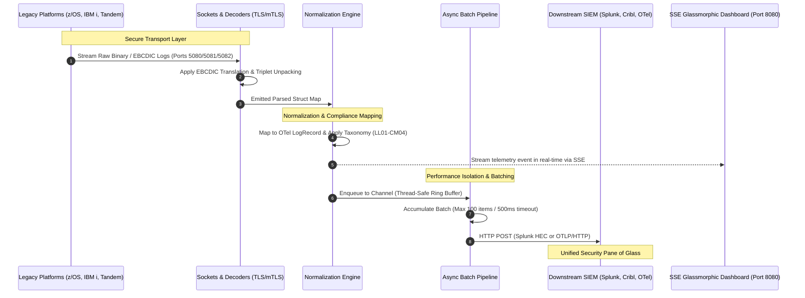

# LegacyTel: Executive & Technical Management Presentation
## Bridging Legacy Core Infrastructure to Modern Observability

---

## 📌 Presentation Overview
This document contains a structured, slide-by-slide presentation designed to be delivered to enterprise management, technical leaders, and security architects. Each slide contains the key visual bullet points, a workflow reference, and detailed **Speaker Notes** to help you deliver a flawless pitch.

### 📊 Presentation Contents
1. **Slide 1: Title & The Vision** - Modernizing Legacy Security Observability
2. **Slide 2: The Business & Security Problem** - The Legacy Silo
3. **Slide 3: Introducing LegacyTel** - The Unified Open-Source Bridge
4. **Slide 4: Platform Deep Dive** - Ingestion & Decoding Technologies
5. **Slide 5: End-to-End Workflow & Architecture** (Visual Diagram)
6. **Slide 6: Key Engineering & Security Decisions** - Why standard-library Go?
7. **Slide 7: Enterprise Value, Cost Reduction & ROI**
8. **Slide 8: Roadmap & Pilot Execution**

---

<!-- slide -->

# Slide 1: Modern Observability for Legacy Infrastructure
## Unifying Mainframe & Midrange Compliance with the OpenTelemetry Ecosystem

### 🔹 Slide Bullet Points
* **The Observability Gap:** Mainframes and legacy systems run 70%+ of global transactional workloads, but exist as blind spots in modern Security Operations Centers (SOCs).
* **LegacyTel Vision:** A lightweight, secure, open-source gateway that ingests native legacy log structures and normalizes them to modern standards in real time.
* **Core Goal:** Standardize z/OS Mainframe, IBM i (AS/400), and HPE NonStop logs to **OpenTelemetry (OTel)** and forward them securely to Splunk, Cribl, or Sentinel.

🎙️ **Speaker Notes:**
> *"Thank you for your time today. I want to talk about one of our most persistent and expensive enterprise challenges: visibility into our core transaction systems. Mainframes, AS/400s, and Tandem NonStops still run the backbone of our enterprise. Yet, when our Security Operations Center attempts to run real-time threat detection or compliance audits, they are blind to these platforms because the logs are stuck in complex, proprietary, binary formats. I built **LegacyTel** to solve this exact problem—a high-performance, open-source, standard-library Go agent that acts as a secure translator and gateway, bringing these legacy giants directly into our modern OpenTelemetry and Splunk ecosystems."*

---

<!-- slide -->

# Slide 2: The Core Problem: The Legacy Log Silo
## Why Legacy Observability is Fractured, Complex, and Expensive

### 🔹 Slide Bullet Points
* **Complex Data Encodings:** Legacy platforms speak raw binary and EBCDIC (Code Page 1047), whereas modern cloud SIEMs and pipelines only accept ASCII, JSON, and OTLP.
* **Heavily Isolated Pipelines:** Logging tools on mainframes and midrange servers are siloed, requiring high-cost, specialized third-party licenses (e.g., proprietary log forwarders).
* **Huge Licensing & License Fees:** Upstream SIEMs are flooded with unstructured heartbeat and noise logs, driving up indexing volume and data consumption license costs.
* **Network Security Risks:** Sending sensitive audit logs across local networks without enterprise-grade encryption or Mutual TLS (mTLS) poses severe compliance risks.

🎙️ **Speaker Notes:**
> *"To understand why we need LegacyTel, we have to look at why legacy observability is broken today. First is the **data encoding barrier**: mainframes write in EBCDIC, a completely different character encoding than the ASCII/UTF-8 used by the rest of the world. Second, legacy logging utilities are **siloed and proprietary**—specialized engineers are needed to extract logs, and licensing proprietary collectors costs hundreds of thousands of dollars annually. Third, there is no **intelligent filtering**, meaning we ingest huge volumes of noisy heartbeat logs, driving up our Splunk or Sentinel bills. Finally, transporting these logs over internal networks without encryption is a major compliance risk. LegacyTel solves all four of these bottlenecks natively."*

---

<!-- slide -->

# Slide 3: Introducing LegacyTel
## The Open-Source, Zero-Dependency Telemetry Gateway

```
+--------------------+
| Legacy Systems     |      +---------------------+      +---------------------+
| z/OS Mainframe (SMF)| ---> |    LegacyTel        | ---> | Splunk Cloud / HEC  |
| IBM i (QAUDJRN)    | ---> | - Decodes EBCDIC    | ---> +---------------------+
| HPE NonStop (EMS)  | ---> | - Standardizes OTel | ---> +---------------------+
+--------------------+      | - Serves SSE Console| ---> | Upstream OTel /     |
                            +---------------------+      | Cribl Stream        |
                                                         +---------------------+
```

### 🔹 Slide Bullet Points
* **Standard-Library Only Build:** Written entirely in pure Go with **zero external package dependencies**—minimizing supply-chain security risks and optimizing execution.
* **Direct Binary Compilation:** Cross-compiles into a standalone, optimized, static binary (<10MB size) with a microscopic resource footprint (<25MB RAM).
* **Native Observability:** Serves an embedded, glassmorphic management dashboard on port `8080` via Server-Sent Events (SSE) for instant, real-time data inspection.
* **Dual Inbound Execution:** Supports both local host daemon deployments and central gateway mode receiving secure streams.

🎙️ **Speaker Notes:**
> *"LegacyTel is a unified, lightweight gateway. It is built in Go using strictly the **standard library**. Why is this critical? Because it means we have zero external code dependencies. There is no risk of supply-chain attacks or library vulnerabilities, which is paramount for our compliance posture. It compiles down to a single, tiny, statically-linked binary under 10 megabytes that consumes less than 25 megabytes of RAM. Compare that to the heavy Java-based or native agent runtimes that consume gigabytes of resource overhead on our critical transaction systems. LegacyTel also features a native, real-time glassmorphic visual dashboard that allows us to inspect log parsing and data streams instantly without placing a burden on downstream systems."*

---

<!-- slide -->

# Slide 4: Ingestion & Decoding Technologies
## How LegacyTel Interacts with Core Platform Log Services

### 1️⃣ IBM z/OS Mainframe Ingest (SMF Records)
* **Underlying Technology:** Real-time TCP stream (port `5080`) over secure TLS. Ingests raw binary System Management Facility (SMF) logs.
* **How it Works:** The agent parses SMF records (Type 30 for jobs, Type 80 for RACF security, Type 90 for operator commands) using byte-offset traversals (triplets).
* **Decoding Engine:** LegacyTel contains a built-in, lightning-fast **EBCDIC Code Page 1047-to-ASCII** translation block executing directly in memory with zero heap allocations.

### 2️⃣ IBM i Series AS/400 Ingest (QAUDJRN Logs)
* **Underlying Technology:** Secure TCP channel (port `5081`) coupled with a native RPG/CL exit program.
* **How it Works:** The RPG exit captures journal modifications in the native `*TYPE5` format containing sequence numbers, job profiles, and entry types, piping them directly to LegacyTel.
* **Decoding Engine:** Deserializes binary midrange structures, mapping key-value attributes (like Authority Failures `AF` or Job Starts `JS`) into human-readable telemetry.

### 3️⃣ HPE NonStop Ingest (EMS Event Streams)
* **Underlying Technology:** Secure socket listener (port `5082`) receiving data from the Tandem Event Management Service (`$ZEMS`).
* **How it Works:** Connects an EMS consumer distributor queue which feeds Tandem kernel events, Subsystem IDs (e.g. `TACL`, `SAFE`, `TMF`), and Cpu/Pin structures.
* **Decoding Engine:** Automatically splits structured headers and maps critical platform violations to standard security indicators.

🎙️ **Speaker Notes:**
> *"Let's look at the underlying technology of each receiver. 
> For **IBM z/OS mainframes**, we feed raw binary SMF records over TLS. LegacyTel traverses the binary offsets using SMF triplet pointers, and passes the bytes through an in-memory CP1047 translation table. This translates character-level EBCDIC to standard ASCII in microseconds with zero library overhead.
> For **IBM i AS/400 midrange systems**, we stream the native Security Audit Journal (QAUDJRN) using a simple, native RPG or Control Language exit program that pipes `*TYPE5` records over TLS.
> For **HPE NonStop Tandem servers**, we bind to the native Event Management Service ($ZEMS) distributor, streaming subsystem events (like Pathway, TMF, or TACL shell logs).
> LegacyTel serves as a single, consolidated hub for all three of these platforms, ensuring that no matter the source, the logs are immediately parsed and normalized."*

---

<!-- slide -->

# Slide 5: End-to-End Log Workflow
## The Data Pipeline from Raw System Bytes to SIEM Dashboard



🎙️ **Speaker Notes:**
> *"Here is the complete end-to-end workflow of how a log travels through the system.
> **First (1-2):** Raw binary or EBCDIC bytes are securely streamed over TLS/mTLS into our dedicated socket receivers. EBCDIC decoding and triplet unpacking happen instantly at the listener boundary.
> **Second (3-4):** The parsed event map is pushed to the Normalization Engine. The processor maps the fields to standard OpenTelemetry LogRecord schemas and categorizes the event using our standard security taxonomy codes—for example, converting a RACF `ICH408I` error or AS/400 authority failure into a unified security failure code `PA02`.
> **Third (5-6):** The event is dispatched to the async queue (a thread-safe channel buffer) and concurrently streamed to our Glassmorphic web console via Server-Sent Events for real-time visualization.
> **Fourth (7-8):** The exporter aggregates events into micro-batches—waiting for either 100 items or a 500ms timeout—and dispatches them asynchronously over HTTP to Splunk HEC or an upstream OTel/Cribl collector. This completely decouples core ingestion performance from downstream SIEM latency."*

---

<!-- slide -->

# Slide 5B: The Normalization Taxonomy
## Unifying Three Heterogeneous Platforms into a Single Compliance Model

| Event Category | Unified Code | z/OS Mainframe | IBM i (AS/400) | HPE NonStop |
| :--- | :--- | :--- | :--- | :--- |
| **Authentication** | `LL01` (Login Success) <br>`LL03` (Login Failure) | SMF 80 (ICH70001I)<br>SMF 80 (ICH408I) | QAUDJRN (JS login)<br>QAUDJRN (PW error) | TACL Log On<br>TACL Failed Log On |
| **Privileges** | `PA01` (Auth Success) <br>`PA02` (Auth Failure) | SMF 80 (Priv Grant)<br>SMF 80 (ICH408I Fail) | QAUDJRN (Auth OK)<br>QAUDJRN (AF Failure) | SAFE Priv Escalation<br>SAFE Violation |
| **Administration**| `SA01` (User Created) <br>`SA08` (Profile Locked) | SMF 80 (Define User)<br>z/OS RACF Revoke | QAUDJRN (Create Prof)<br>QAUDJRN (Disable Prof) | SAFE User Created<br>SAFE Profile Locked |
| **Operations** | `SS01` (Job/App Start) <br>`CM02` (CPU Threshold) | SMF 30 (Job Start)<br>SMF 30 (IEF085I CPU) | QAUDJRN (JS Job Start)<br>AS400 Queue Limit | TMF Coord Start<br>Pathway CPU Alert |

🎙️ **Speaker Notes:**
> *"To ensure that our analysts in the SOC don't need to be experts in mainframe or AS/400 terminology, the processor maps all events to a unified security and operational taxonomy.
> A failed password on z/OS (RACF ICH408I), an AS/400 password error, and a Tandem TACL shell failure are all automatically tagged with a unified **LL03** code.
> An authorization failure—whether it is RACF denying access to `SYS1.PARMLIB` on the mainframe, or an Authority Failure (`AF`) on an AS/400 library, or a SAFE violation on a Tandem disk volume—is unified under **PA02** (Privileged Access Denied).
> This means our security correlation rules, alerts, and dashboards in Splunk are identical across all three platforms, reducing incident triage times."*

---

<!-- slide -->

# Slide 6: Core Architectural & Security Decisions
## Built for Enterprise Rigor, Stability, and Compliance

### 🔒 Zero-Trust Transport (TLS & mTLS)
* Native implementation of standard-library TLS 1.2/1.3.
* **Mutual TLS (mTLS):** Enforces client certificate verification. Only authorized host daemons or exit programs can stream data to the gateway.

### ⚡ Async Performance Isolation
* **Buffered Go Channels:** Log ingestion operates on dedicated goroutines decoupled from exporters.
* Downstream network degradation or Splunk endpoint slowdowns *never* backpressure the mainframe or legacy socket collectors.

### 🛡️ Standard-Library-Only Security Strategy
* ZERO third-party packages or modules used in the Go runtime.
* Eradicates the possibility of dependency bloat, security vulnerabilities, or licensing liabilities.
* Eliminates GCC compilation dependencies (`CGO_ENABLED=0`), allowing simple cross-compilation directly to standard architectures (IBM Open Enterprise SDK for Go, PASE, x86-64, etc.).

🎙️ **Speaker Notes:**
> *"From an engineering and security perspective, we made several foundational decisions. 
> First, **Zero-Trust Transport**: all TCP log feeds are protected using native TLS, with Mutual TLS (mTLS) enforcement. This guarantees that only authorized servers can stream events to our gateway. 
> Second, **Performance Isolation**: we use buffered Go channels. Ingestion runs on separate goroutines from the exporting pipeline. If Splunk is down or Cribl experiences network latency, LegacyTel absorbs the spikes inside its circular ring buffer. It *never* pushes backpressure onto our production transactional platforms.
> Third, **Standard-Library-Only Strategy**: using Go's built-in standard library guarantees absolute code safety, zero external package vulnerabilities, and allows us to compile CGO-free. This lets us generate ultra-stable binaries that can run natively in the PASE midrange environment or run on mainframe Linux without modification."*

---

<!-- slide -->

# Slide 7: Enterprise ROI & Financial Impact
## Reducing Licensing Fees, Operating Costs, and Observability Overhead

### 💸 Drop Splunk & SIEM Ingestion Overhead
* By filtering standard, repetitive daily operational heartbeats (`SS05`) at the gateway layer (or via Cribl Stream drop rules), we reduce SIEM ingestion volume by up to **40%**.
* **Financial Impact:** Substantial savings in Splunk / Sentinel data ingestion license costs while retaining high-value audit trails.

### 📂 Consolidate Proprietary Software Licenses
* Replaces expensive legacy-to-SIEM proprietary forwarders with a single, open-source, standard-aligned tool.
* **Financial Impact:** Saves thousands in annual vendor maintenance fees and licensing overhead per system.

### ⚙️ Reduce Compute & Operational Burden
* Microlight runtime (<25MB RAM, <1% CPU load) removes the threat of performance penalties on core systems.
* Unifies operations under a single team, eliminating the need for siloed platform-specific monitoring specialists.

🎙️ **Speaker Notes:**
> *"Beyond technical excellence, LegacyTel brings massive financial and operational ROI to the enterprise. 
> First, **SIEM Cost Reduction**: by normalizing logs and leveraging intelligent drop/filter rules (for example, filtering routine, low-risk operational heartbeats using Cribl drop filters), we can reduce our Splunk or Microsoft Sentinel daily ingestion volume by up to 40% for legacy log sources. This translates directly to significant licensing savings.
> Second, **Vendor Consolidation**: we can decommission expensive, proprietary legacy forwarders and replace them with a unified, standard-aligned solution. 
> Third, **System Performance**: because the agent consumes negligible resources—less than 25MB of RAM—we don't risk transaction delays or have to pay for additional compute capacity on our midrange and mainframe environments."*

---

<!-- slide -->

# Slide 8: Execution Roadmap & Pilot Phase
## Rapid Evaluation and Native Ingest Testing

```
+--------------------------------------------------------------------------+
|  📅 WEEK 1: Sandbox Gateway Setup                                        |
|  - Spin up LegacyTel Gateway on macOS/Linux in Gateway Mode              |
|  - Launch the SSE Glassmorphic Dashboard to verify live pipelines        |
+--------------------------------------------------------------------------+
                                    │
                                    ▼
+--------------------------------------------------------------------------+
|  📅 WEEK 2: Ingest Ingestion Test                                         |
|  - Configure local simulation streams for z/OS, IBM i, and HPE NonStop   |
|  - Deploy SSL/TLS certificates using the built-in cert-generator script  |
+--------------------------------------------------------------------------+
                                    │
                                    ▼
+--------------------------------------------------------------------------+
|  📅 WEEK 3: SIEM & Pipeline Integration                                  |
|  - Set up dual exporters mapping to Splunk HEC and OTel Collectors       |
|  - Apply Cribl filtering rules to isolate heartbeats from alerts         |
+--------------------------------------------------------------------------+
                                    │
                                    ▼
+--------------------------------------------------------------------------+
|  📅 WEEK 4: Production Evaluation                                        |
|  - Move host daemons to test environments (z/OS Sysplex & LPARs)         |
|  - Begin complete security compliance reporting under single dashboard  |
+--------------------------------------------------------------------------+
```

🎙️ **Speaker Notes:**
> *"To move forward, I have laid out a low-risk, highly structured **4-week execution roadmap**.
> In **Week 1**, we will set up the LegacyTel Gateway in a sandbox environment and launch the embedded SSE console.
> In **Week 2**, we will hook up our simulation data streams and generate local root and client certificates using our automated certificate utility to verify TLS/mTLS secure transport.
> In **Week 3**, we will integrate the outbound pipelines with Splunk HEC and our upstream OpenTelemetry Collectors, applying Cribl Stream dropping rules to test ingestion optimization.
> Finally, in **Week 4**, we will begin moving our platform-specific test daemons into our development LPARs and partitions, unifying our mainframe and midrange observability under a single security pane of glass.
> Thank you, and I am happy to open the floor to any questions!"*
